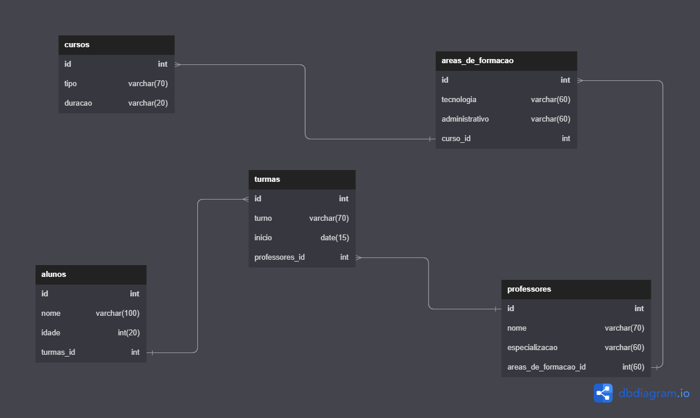

# Projeto-banco-de-dados sistema Resilia

A Resilia está pensando em lançar um novo sistema de
acompanhamento e para isso precisa de ajuda para modelar um
banco de dados que vai armazenar seus cursos, turmas e alunos.

Para apoiar nesse sistema recebemos a tarefa de realizar essa modelagem
e responder algumas perguntas com nosso modelo:

Existem outras entidades além dessas três?

sim, adicionei professores e área de formação, mas também teria espaço para a coordenação e gestores.

Quais são os principais campos e tipos?

